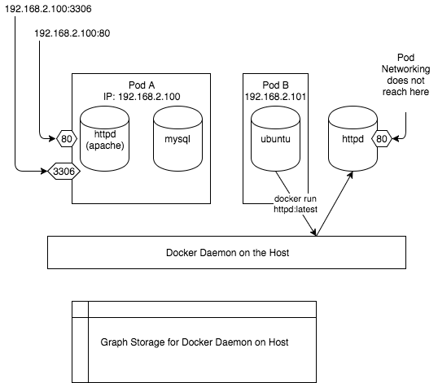

# k8s-scanner

## Architecture

1. Install and login to rf cli tools
1. Use python kubernetes client to list all pods in all namespace and collect unique container images
1. Runs rf-scan tool on the image list
1. In order to run rf-scan, we Docker-outside-of-Docker design
1. This runs as k8s cron job which currently runs every 12 hours

### Ref
* https://github.com/kubernetes-client/python/blob/master/examples/in_cluster_config.py
* https://applatix.com/case-docker-docker-kubernetes-part-2/
